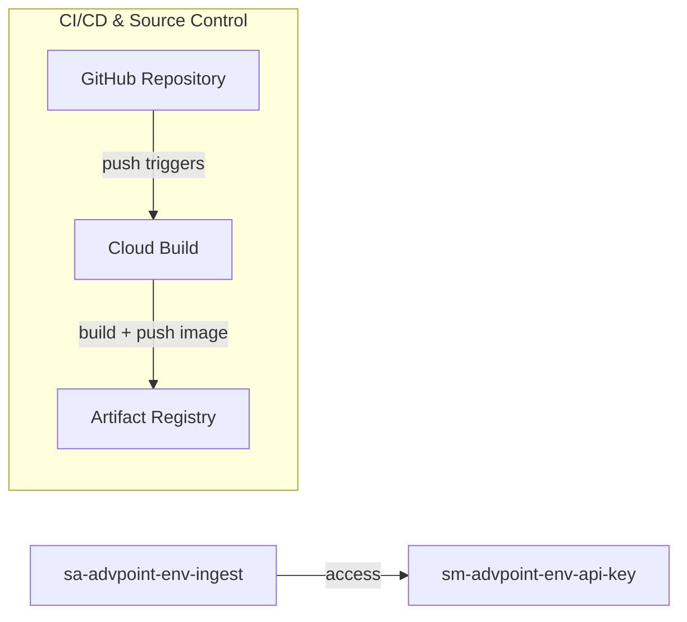
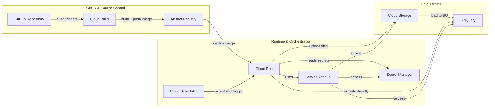
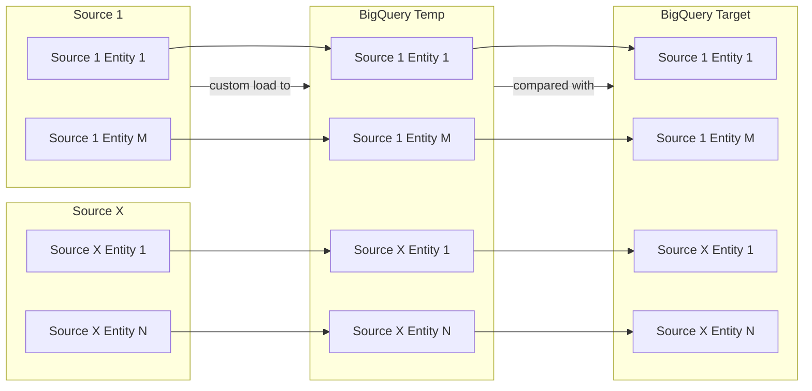
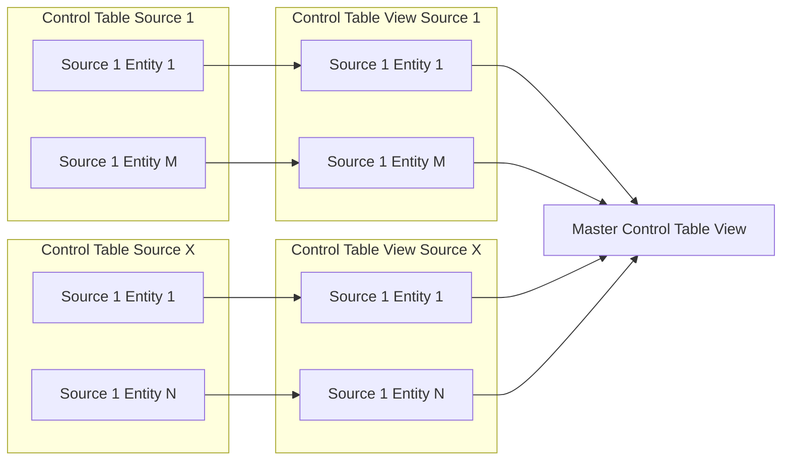

# AdvantagePoint Data Ingestion Architecture

This project implements a lightweight, serverless ingestion pipeline using Google Cloud Platform (GCP). The design prioritizes **simplicity**, **low cost**, and **scalability** for future growth.

---

## Overview

The system ingests data from external sources (e.g., Web, APIs or Excel files) on a scheduled basis and writes it to BigQuery.

---

## Architecture Components

| Name | Type | Description |
|---|---|---|
| `repo-advpoint` | GitHub Repository | Stores Python-based ingestion code. |
| `sa-advpoint-env-ingest` | Service Account | Used to run Google Cloud ingestion processes. | 
| `cb-advpoint-env-ingest` | Cloud Build | Triggers Docker container build on GitHub repo branch push. Deploys repo code to Google Cloud. |
| `ar-advpoint-env-ingest` | Artifact Registry | Stores Docker container image. |
| N/A | Secrets Manager | Stores project secrets. |

`sa-advpoint-env-ingest` needs the following roles:
- `Logs Writer`: write logs to Cloud Logging
- `Logs Viewer`: read logs
- `Artifact Registry Writer`: upload artifacts to Artifact Registry

| Name | Type | Description | IAM / Permissions Required | Notes |
|---|---|---|---|---|
| `proj-ingest` | GitHub Repository | Stores Python-based ingestion code | N/A | GitHub triggers Cloud Build via branch push |
| `cb-advpoint-env-ingest` | Cloud Build Trigger | Builds Docker container on branch push | Cloud Build SA needs `artifactregistry.writer`, `run.admin` | Trigger can be created manually or via Terraform |
| `ar-advpoint-env-ingest` | Artifact Registry | Stores built Docker container images | `roles/artifactregistry.writer` for Cloud Build SA | Optional: prefix with region (e.g. `us-east1`) |
| `cr-advpoint-env-ingest` | Cloud Run Service | Executes ingestion logic via container | Runs as `sa-advpoint-env-ingest` | Uses container image from Artifact Registry |
| `sched-advpoint-env-ingest` | Cloud Scheduler Job | Triggers ingestion via Cloud Run on a schedule | `roles/run.invoker` on Cloud Run | Optional: can be added later |
| `sm-advpoint-env-api-key` | Secret Manager Secret | Stores sensitive credentials or API keys | `roles/secretmanager.secretAccessor` for Cloud Run SA | Add secret values manually after creation |
| `gcs-proj-id-env-ingest` | Cloud Storage Bucket | Temporarily stores raw files during ingestion | `roles/storage.objectAdmin` for Cloud Run SA | Bucket name must be globally unique |
| `bq-advpoint-env-ingest` | BigQuery Dataset | Final storage for ingested structured data | `roles/bigquery.dataEditor` for Cloud Run SA | Source-level schemas supported within dataset |
| `sa-advpoint-env-ingest` | Service Account | Identity used by Cloud Run | Access to Secret Manager, GCS, and BigQuery | Assigned to Cloud Run when deploying container |

---

## Execution Flow

1. Developer pushes code to branch in GitHub.
2. Cloud Build detects the push and:
   - Builds a Docker image
   - Pushes it to Artifact Registry
   - Deploys it to Cloud Run
3. Cloud Scheduler triggers the Cloud Run service on a defined schedule.
4. Cloud Run:
   - Reads ingestion metadata from BigQuery (control table)
   - Loads credentials from Secret Manager
   - Ingests data from source
   - Optionally stages files in Cloud Storage
   - Writes final data to BigQuery

---

## Data Flow Overview

1. Data is retrieved from each source and sent to a BigQuery 'temporary' table.
    - Each source may have its own custom data retrieval method depending on the source type (ex. API, SQL, Excel).
    - The temporary table is meant to contain data from the current ingestion process run.
    - The ingesiton process run may perform a full (grab all records) or incremental (grab new/modified records) load, depending on preferences, optimizations, constraints, and limitations by the source system as well as Google Cloud.
2. Data in the temporary table is compared to that in the target table.
    - Schema drift is handled.
    - Inserts, updates, deletions are handled.

---

## BigQuery

---

## Why This Design

- **Simple**: Minimal GCP services, easy to reason about.
- **Low-cost**: Pay only when jobs run (Cloud Run + Scheduler).
- **Scalable**: Easily supports more sources, and can evolve to Airflow or Dataflow later.

---

## Future Enhancements

- Add Airflow (Cloud Composer) for orchestration across many sources
- Use Dataflow for high-volume, real-time streaming ingestion
- Integrate Pub/Sub for event-driven file ingestion