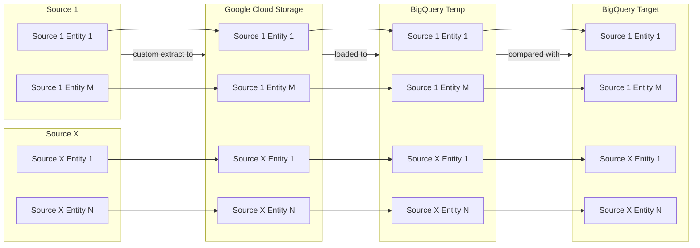
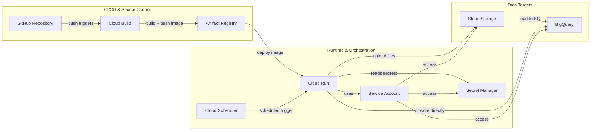
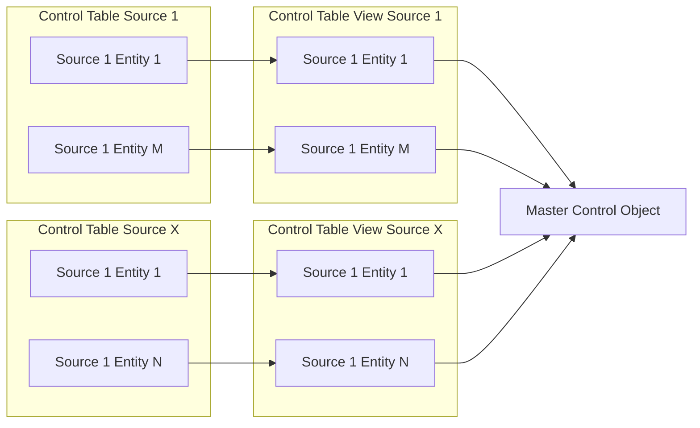

# AdvantagePoint Data Ingestion Architecture

This ingestion framework implements a lightweight, serverless ingestion pipeline using Google Cloud Platform (GCP). The design prioritizes **simplicity**, **low cost**, and **scalability** for future growth.

---

## Overview

The system ingests data from external sources (e.g., Web, APIs or Excel files) on a regular basis and writes it to BigQuery. The overall flow is:
1. Data is retrieved from each source and sent to Google Cloud Storage
    - Each source may have its own custom data retrieval method depending on the source type (ex. API, SQL, Excel).
    - The ingestion process run may perform a full (grab all records) or incremental (grab new/modified records) load, depending on preferences, optimizations, constraints, and limitations by the source system as well as Google Cloud.
    - Benefits of loading data to Cloud Storage:
        - Central repository of historical data that can be reloaded to BigQuery at any point, especially for backup/failure reasons.
        - Handles semi-structured and unstructured data ingestion.
2. Cloud Storage data files are loaded to a BigQuery 'temporary' table.
    - The temporary table is meant to contain data from the current ingestion process run.
    - Table is dropped and recreated, picking up any column/data type changes.
3. Data in the temporary table is compared to that in the target table.
    - Schema drift is handled.
    - Inserts, updates, deletions are handled.

---

## Setup

### Architecture

| Name | Type | Description |
|---|---|---|
| `advantage-point-ingest` | GitHub Repository | Stores Python-based ingestion code |
| `cb-advpoint-prod-ingest` | Cloud Build Trigger | Builds Docker container on branch push |
| `ar-advpoint-prod-ingest` | Artifact Registry | Stores built Docker container images |
| `cr-advpoint-prod-ingest` | Cloud Run Service | Executes ingestion logic via container | Runs as `sa-advpoint-prod-ingest` | Uses container image from Artifact Registry |
| `sched-advpoint-prod-ingest` | Cloud Scheduler Job | Triggers ingestion via Cloud Run on a schedule |
| `sm-advpoint-prod-api-key` | Secret Manager Secret | Stores sensitive credentials or API keys |
| `gcs-proj-id-prod-ingest` | Cloud Storage Bucket | Temporarily stores raw files during ingestion |
| `bq-advpoint-prod-ingest` | BigQuery Dataset | Final storage for ingested structured data |
| `sa-advpoint-prod-ingest` | Service Account | Identity used by Cloud Run |

1. Developer pushes code to branch in GitHub.
2. Cloud Build detects the push and:
   - Builds a Docker image
   - Pushes it to Artifact Registry
   - Deploys it to Cloud Run
3. Cloud Scheduler triggers the Cloud Run service on a defined schedule.
4. Cloud Run:
   - Reads ingestion metadata from BigQuery (control table)
   - Loads credentials from Secret Manager
   - Ingests data from source into Cloud Storage
   - Loads final data to from Cloud Storage to BigQuery

---

### BigQuery

The flow/roles of these control objects are:
1. `control table`
    - Contains necessary ingestion information for each source/entity.
    - If calculations/value patterns are observed/needed, then they should go in `control table view` and/or `control object master.`
2. `control table view`
    - Contains additional source-specific logic.
        - `control_table_table_name`: Underlying control table
        - `bigquery_target_table_id`: While this column appears in all `control table view`s, the logic may differ, so it should be constructed in this object
3. `control object master`
    - Contains column logic common among all control table views. Either:
        - Column logic must be the same
        - Column calculations done in `control table view` and column is referenced in `control object master`.
    - Contains same column but different logic:
        - `control_table_view_name`
    - Contains logic common among all `control table view`s:
        - `biquery_temp_project_id`
        - `bigquery_temp_dataset_id`
        - `bigquery_temp_table_id`
        - `is_active`

The general flow is:
1. Create a table to store source/entity information.
2. Create a view on top of the table to create/override column values.
3. Create a view/table on top of the views from step 2 that unions all views.

Some flexibility can be done:
- If _source 1_ and _source X_ contain similar ingestion processes/logic, it may make sense to either create one control table for both _source 1_ and _source X_ entity records or UNION both control tables into a single control table view.
- If the query in the master control object (if view) requires a lot of compute, then it may make sense to CREATE/REPLACE a table using the desired query.
- Building a view on top of a table gives the flexiblity of:
    - Hardcoding a column value in the view rather than adding/updating a column/value in the table's INSERT statement. Note that if values may differ between entities, then either a CASE WHEN statement can be used within the view (if simple enough) or reinserting/updating the table records.
    - If a 'simple' calculation is needed to create a new column OR to overwrite the underlying table column, then the calculation can occur within the view without the need to update the record's table entry.

| Column | control_table__ingest__{source} | vw__control_table__ingest__{source} | control_object__ingest__master |
|---|---|---|---|
| id | created in this object | selected in this object to join to other control objects | selected in this object to join to other control objects |
| source-specific columns | inserted/updated in this object | selected in this object so that additional source-specific columns/logic is applied | 
| biquery target project and dataset columns | inserted/updated in this object | selected in this object |
| bigquery target table columns | N/A | created in this object as it depends on source-specific data | selected in this object |
| bigquery temp project, dataset, table columns | N/A | created in this object as it is based on target table data and logic is same regardless of source |

---
